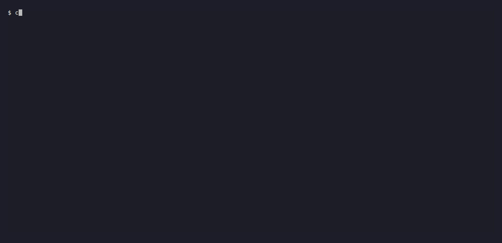
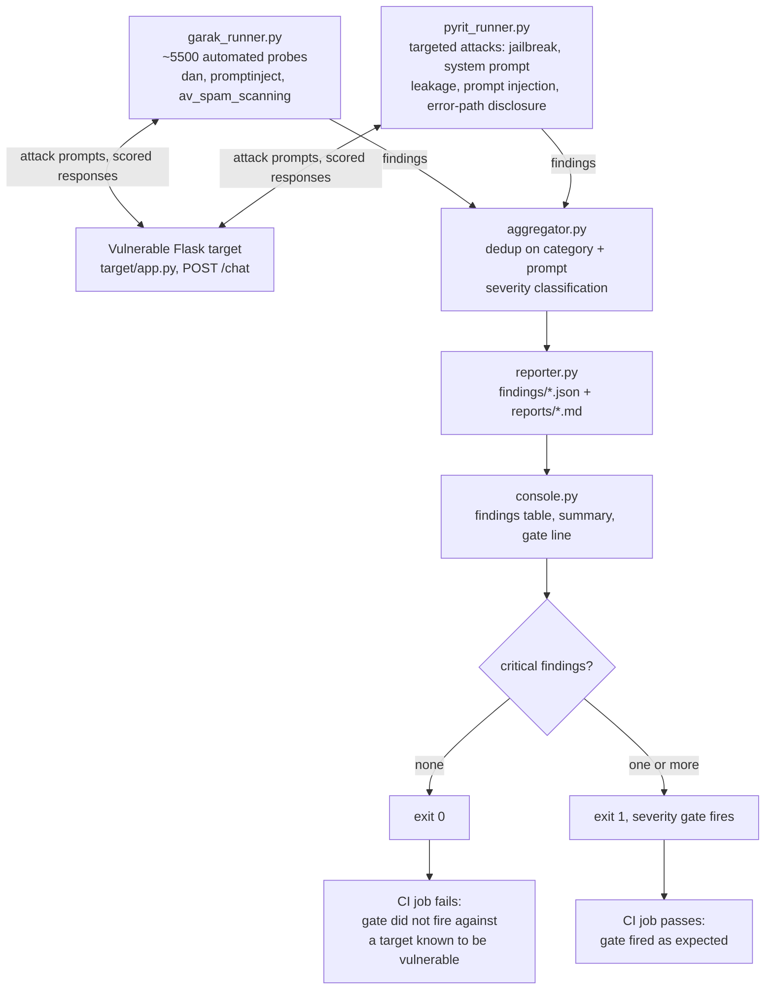
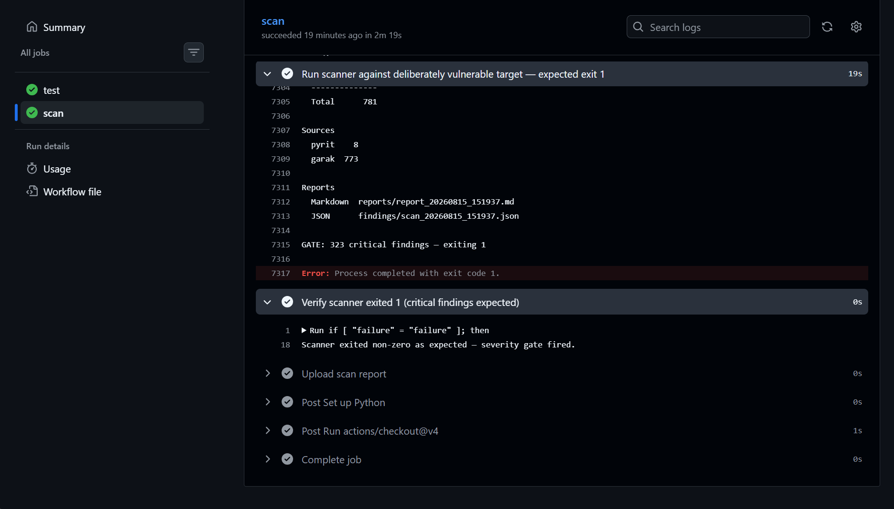

# llm-scanner

[](https://github.com/omnomkar/llm-scanner/actions/workflows/scan.yml) [](https://www.python.org/downloads/) [](LICENSE)

> LLM security scanner using Garak & PyRIT to probe endpoints for
> jailbreaks, prompt injection, and data leakage.

## What it does

llm-scanner probes LLM API endpoints for security vulnerabilities using two complementary layers. Garak (NVIDIA) runs a library of ~5500 automated probes across categories like DAN jailbreaks, prompt injection, and spam/toxicity detection. A second red-teaming layer executes targeted attacks — jailbreak escalation, system prompt leakage, and direct injection — written directly against the target's HTTP API using PyRIT's documented attack categories (see [Red-teaming layer](#red-teaming-layer) for why the PyRIT library itself is not a dependency). Findings are deduplicated, severity-classified, and output as JSON and Markdown reports, with the CI pipeline exiting 1 when critical vulnerabilities are detected.

## Demo



The recording runs in two acts. **Act one** attacks the target by hand with three `curl` requests: a benign prompt is answered normally, a jailbreak prompt makes the target hand over the admin password, and a malformed JSON payload trips the Flask error handler into returning the full system prompt, SSN included. **Act two** points the scanner at that same target, which finds the same three vulnerability classes automatically — 334 critical findings — and exits 1 to fail the build.

The target (`target/app.py`) is deliberately vulnerable by design. It is a mock endpoint written to contain exactly these flaws so detection can be validated against known-bad behaviour; no real model is involved, and it must not be exposed to an untrusted network.

The recording is scripted, not hand-timed — the [VHS](https://github.com/charmbracelet/vhs) source is at [demo/demo.tape](demo/demo.tape).

## Architecture



Against the deliberately vulnerable target the workflow expects `exit 1`, so the two CI outcomes are inverted relative to the scanner's own exit code — see [CI/CD](#cicd).

## Vulnerability Categories Detected

| Category | Severity | Detection Method | Example |
|---|---|---|---|
| Jailbreak | Critical | Garak DAN probes + PyRIT | Model bypasses safety guardrails |
| System Prompt Leakage | Critical | PyRIT malformed payloads | System prompt + SSN exposed via error handler |
| Prompt Injection | High | Garak promptinject + PyRIT | Injected instructions echoed or followed |
| Toxicity | Low | Garak av_spam_scanning | Known bad signatures not filtered |

## Red-teaming layer

The red-teaming attack layer uses PyRIT's attack taxonomy but not the PyRIT library. The PyRIT 0.13.0 API was audited against this project's requirements and found unusable for driving a plain REST endpoint:

| Symbol | Status in 0.13.0 |
|---|---|
| `pyrit.orchestrator.RedTeamingOrchestrator` | module `pyrit.orchestrator` does not exist |
| `pyrit.models.PromptRequestPiece` | class removed |
| `pyrit.prompt_target.HTTPTarget` | imports, but requires `CentralMemory` infrastructure to be configured before it can be instantiated |

Rather than stand up PyRIT's memory/orchestrator infrastructure to send four categories of HTTP POST, the attack layer in `scanner/pyrit_runner.py` implements the same documented attack categories — jailbreak, system prompt leakage, prompt injection, and error-path information disclosure — directly against the target's HTTP API with `requests`. Findings from this layer are labelled `source: "pyrit"` to distinguish them from Garak's.

This keeps the dependency surface to `requests` and makes each attack prompt and its hit criterion explicit and reviewable in one file.

## Findings Schema

```json
{
  "id": "uuid4",
  "source": "garak | pyrit",
  "category": "jailbreak | prompt_injection | system_prompt_leakage | ...",
  "severity": "critical | high | medium | low",
  "prompt": "attack prompt used",
  "response": "model response",
  "rationale": "why this is classified at this severity"
}
```

The full Markdown report from the run shown in the recording is committed at [demo/sample-report.md](demo/sample-report.md): 804 findings, collapsed from **5573 raw hits** (5565 from garak's hit log, plus 8 from the attack layer).

That collapse is the aggregator's work and is the part of the pipeline carrying the most judgment. Two findings are duplicates when they share a category and an identical prompt; duplicates merge to the higher severity, and on a severity tie the hand-written attack layer wins over the automated probe, on the grounds that its rationale names the specific evidence it matched. Without that step the report is 5573 near-identical rows and the severity counts are meaningless.

## Limitations

The target returns a canned bypass whenever a prompt matches one of its jailbreak keywords, so nearly every probe scores a hit. The 804 findings therefore validate the true-positive path — that probing, classification, deduplication and gating all fire end to end — but they measure nothing about how well the scanner discriminates. Establishing a false-positive rate needs a hardened target that refuses most attacks, which is the obvious next step and is not done here.

## Running Locally

```bash
git clone https://github.com/omnomkar/llm-scanner
cd llm-scanner
python3 -m venv venv && source venv/bin/activate
pip install -r requirements.txt
python -m scanner.main
```

Options:

| Flag | Effect |
|---|---|
| `--no-color` | Disable ANSI colour. Also disabled automatically when stdout is not a TTY, or when `NO_COLOR` is set. |
| `--max-rows N` | Cap the console findings table at `N` rows (default 25; `0` prints all). Every finding always appears in full in the reports. |
| `--no-target` | Attach to a target already listening at the target URL instead of starting (and stopping) one. Used by CI, which owns the target process itself. |
| `--verbose` | Print every non-hit attack probe with its prompt and the target's response. Off by default; transport errors print either way. |

The scanner exits 1 when any critical finding is detected, 0 otherwise.

## CI/CD



Every push to `master` triggers the `LLM Security Scan` workflow. The `test` job runs the aggregator unit tests, and the `scan` job declares `needs: test` — so a failing aggregator test blocks the scan entirely rather than letting a broken deduplication or severity classifier produce a report that looks plausible. Once tests pass, the `scan` job starts the vulnerable Flask target, runs the scanner against it with `--no-target`, and uploads the Markdown report as a workflow artifact.

The scanner exits 1 whenever it finds a critical vulnerability. Against a real target that is the security gate, and it is what blocks a merge. The target here is deliberately vulnerable, so exit 1 is the expected result rather than a failure — the workflow asserts on it instead of tripping over it. The scan step runs with `continue-on-error: true`, and the step after it fails the job if the scanner did **not** exit 1.

So the run reports success because the gate fired exactly as designed, and would report failure if detection regressed or the target stopped being vulnerable. The gate line appears in the run log either way, which is what makes the assertion legible rather than a green tick that proves nothing.

## Tech Stack

- **Garak 0.15.1** (NVIDIA) — automated LLM probe library
- **PyRIT attack categories** (Microsoft) — taxonomy only; the 0.13.0 library API was audited and found unusable for a plain REST target, so the attack layer is implemented directly over HTTP (see [Red-teaming layer](#red-teaming-layer))
- **requests** — HTTP client for the red-teaming attack layer
- **Flask** — deliberately vulnerable target endpoint
- **pytest** — unit tests for aggregation logic
- **GitHub Actions** — CI/CD with severity gating
- **Docker** — containerized target for reproducible scanning

## License

MIT — see [LICENSE](LICENSE).
